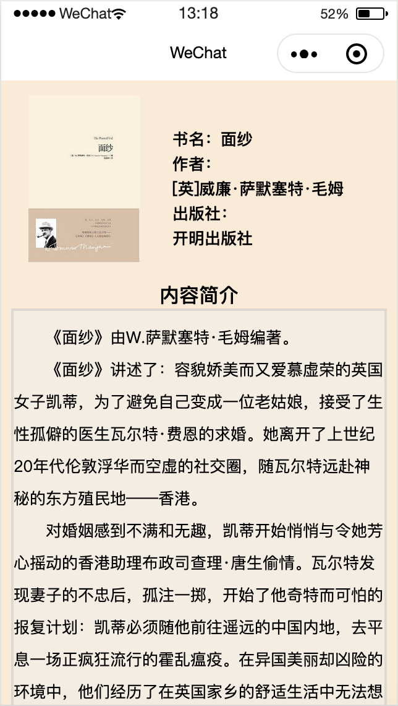
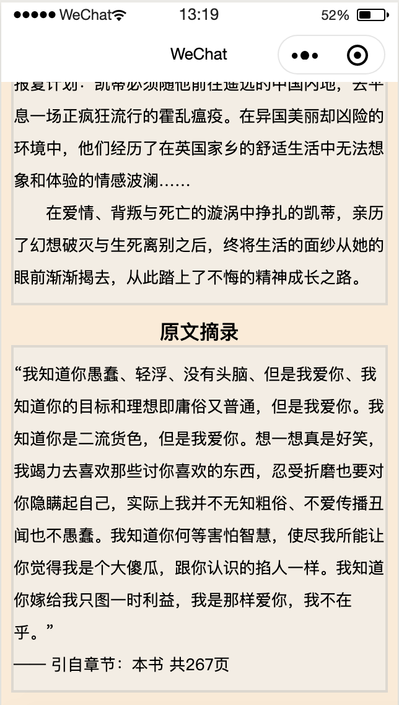

## 课后作业-图书介绍页

本次作业我选择的是图书介绍页，页面包括图书封面、书名、作者、出版社、内容简介和原文摘录

**小程序基础**

小程序的主要页面是xx.js和xx.wtml，这两个页面为必须，js文件负责事件的发生，wtml是页面的信息，想设计ui界面就要涉及到wxss，基本上和css差不多，可能在语法上有一些区别，比如标签view就相当于div等等；

**页面UI设计的一些简单的知识点：**

1. 小程序中的flex容器和元素：

   flex-direction：元素的排列方式

   flex-wrap：元素的换行方式

   justify-content：元素在主轴上的对齐方式

   align-items：元素在交叉轴上的对齐方式

2. 页面展示（具体代码在pages/Firstpage内）

